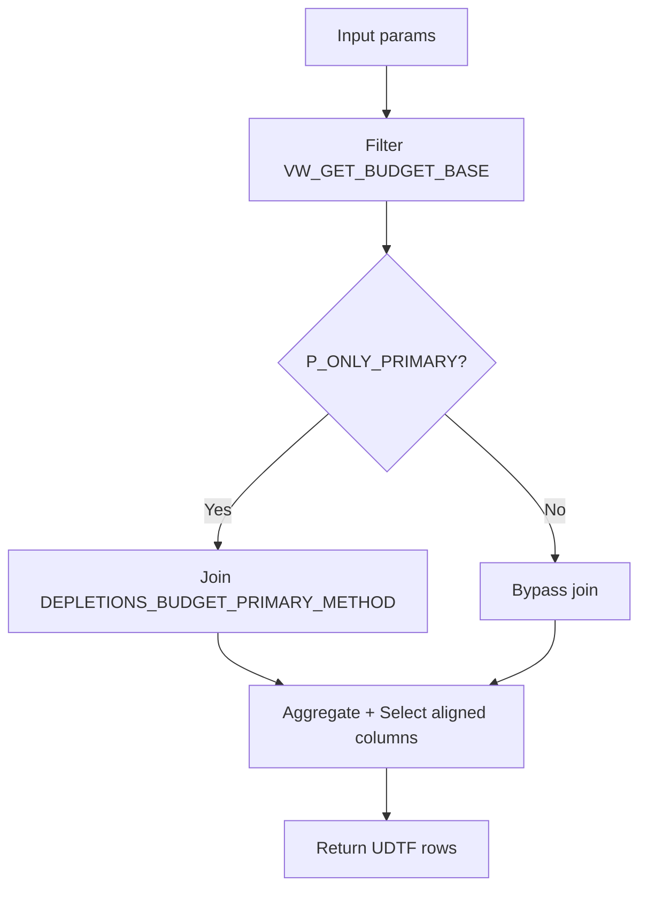

### Design — Budget Depletions UDTF Alignment

#### Architecture Overview
- Stage 1: Filter base view `FORECAST.VW_GET_BUDGET_BASE` using parameters (`P_BUDGET_CYCLE_DATE`, `P_FORECAST_METHOD`, `P_MARKETS`, `P_CUSTOMERS`, `P_VARIANT_SIZE_PACK_IDS`).
- Stage 2: Apply primary-method preference join to `FORECAST.DEPLETIONS_BUDGET_PRIMARY_METHOD` when `P_ONLY_PRIMARY` is TRUE.
- Stage 3: Aggregate and project output columns to mirror the forecast UDTF (excluding specified fields).

#### Interfaces / Data Contracts
- Input:
  - `P_BUDGET_CYCLE_DATE DATE`
  - `P_FORECAST_METHOD VARCHAR`
  - `P_MARKETS ARRAY`
  - `P_CUSTOMERS ARRAY` (matches first 5 of `DISTRIBUTOR_ID`)
  - `P_VARIANT_SIZE_PACK_IDS ARRAY`
  - `P_ONLY_PRIMARY BOOLEAN`
- Output (columns, order):
  - MARKET_ID, MARKET, MARKET_AREA_NAME, CUSTOMER_ID, CUSTOMER,
    BRAND, VARIANT, VARIANT_ID, VARIANT_SIZE_PACK_DESC, VARIANT_SIZE_PACK_ID,
    YEAR, MONTH, FORECAST_METHOD, BUDGET_CYCLE_DATE,
    DATA_TYPE, IS_MANUAL_INPUT, FORECAST_STATUS, CURRENT_VERSION,
    COMMENT, CASE_EQUIVALENT_VOLUME, PY_CASE_EQUIVALENT_VOLUME,
    CY_3M_CASE_EQUIVALENT_VOLUME, CY_6M_CASE_EQUIVALENT_VOLUME, CY_12M_CASE_EQUIVALENT_VOLUME,
    PY_3M_CASE_EQUIVALENT_VOLUME, PY_6M_CASE_EQUIVALENT_VOLUME, PY_12M_CASE_EQUIVALENT_VOLUME,
    GSV_RATE

- Mapping guidance (from base):
  - `MARKET_ID := MARKET_CODE`
  - `CUSTOMER_ID := LEFT(DISTRIBUTOR_ID,5)` and `CUSTOMER := DISTRIBUTOR_NAME`
  - `YEAR := FORECAST_YEAR`
  - Where a field is not present in the base view, project `NULL` (typed appropriately)

#### Diagram

#### Trade-offs / Decisions
- Favor column name alignment to forecast UDTF for downstream parity (R-005)
- Use `NULL` defaults for unavailable dimensions to avoid failures (R-005)
- Reuse aggregation patterns from forecast UDTF (R-006)
- Default to primary method when `P_FORECAST_METHOD` is NULL (R-007)

#### Risks & Mitigations
- Some dimensions may be absent in `VW_GET_BUDGET_BASE` (e.g., `MARKET_AREA_NAME`, `BRAND`).
  - Mitigation: Project `NULL` with correct types; revisit view enrichment later.
- `GSV_RATE` availability may vary.
  - Mitigation: Use `ANY_VALUE(GSV_RATE)` when present; otherwise `NULL`.

#### Traceability
- R-001 → Stage 1 filter by `BUDGET_CYCLE_DATE`
- R-002 → Filter predicates using `ARRAY_CONTAINS`
- R-003 → Filter by `FORECAST_METHOD`
- R-004 → Primary-method join logic
- R-005 → Output projection schema
- R-006 → Aggregation functions and rounding
- R-007 → Default behavior when method is NULL
