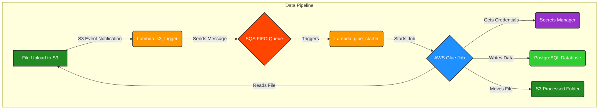
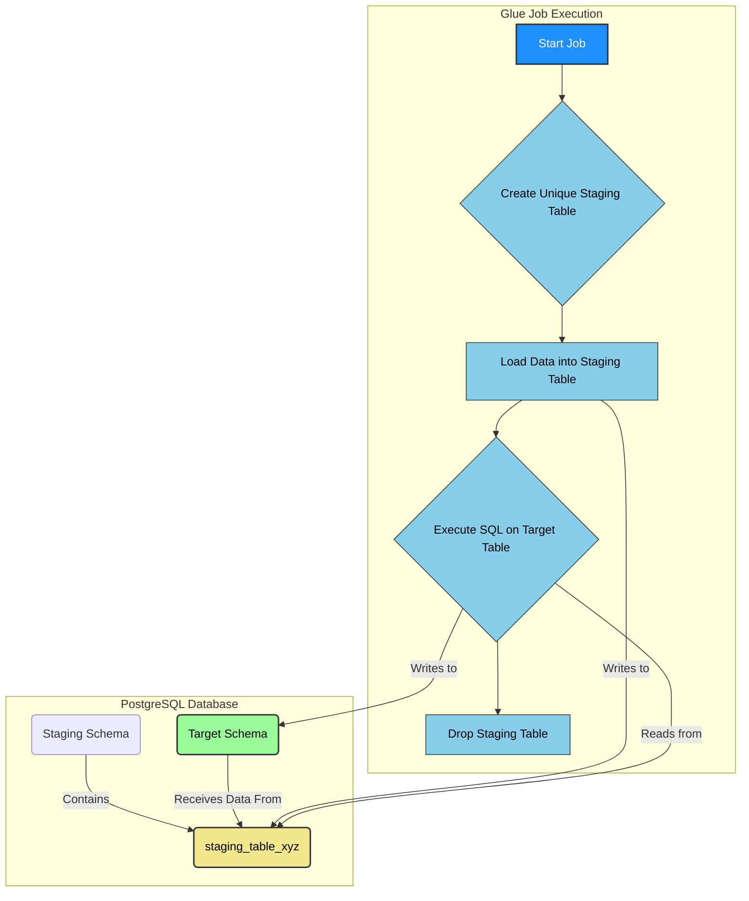
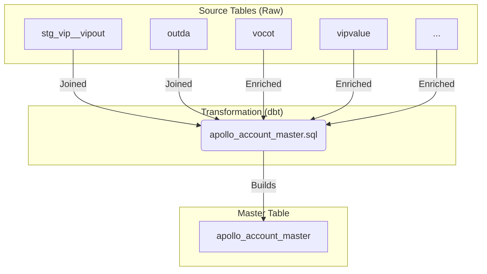
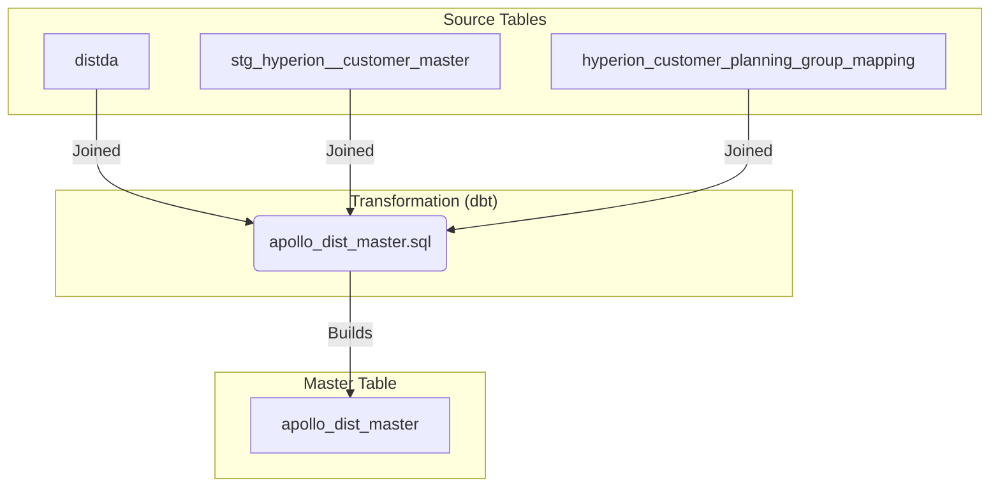
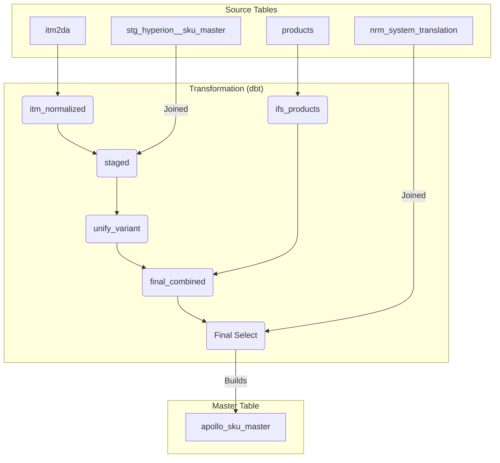
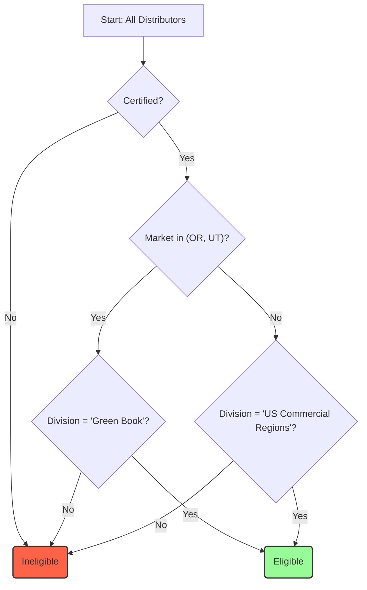
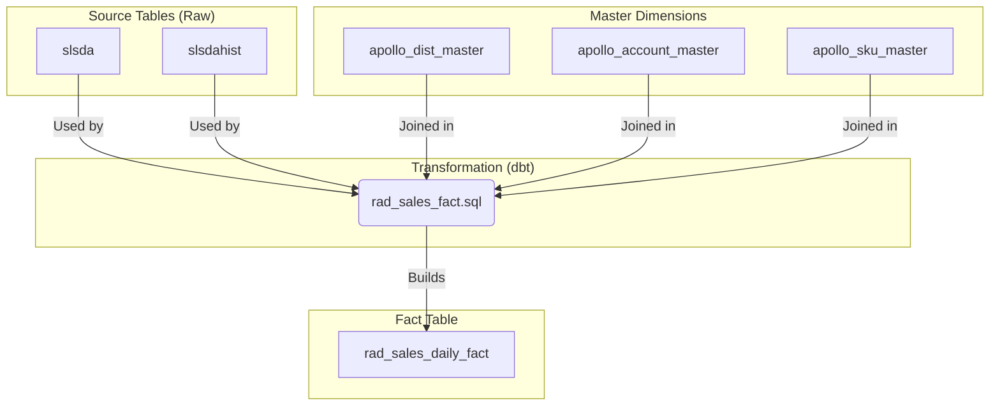

# Apollo Data Model Documentation

## Data Ingestion from S3 into Postgres

This section details the automated pipeline that ingests data from Amazon S3 into the PostgreSQL database. The process is designed to be robust, scalable, and event-driven, leveraging several AWS services.

### 1. Architecture and Workflow

The data ingestion pipeline is orchestrated through a sequence of AWS services, starting with a file upload to S3 and culminating in a data upsert operation in PostgreSQL.

**Workflow Diagram:**



**Workflow Steps:**

1.  **File Upload**: A user or automated process uploads a data file (e.g., `SLSDA.WGS.gz`) into a designated `upload/` prefix in the S3 bucket.
2.  **S3 Event Trigger**: The S3 `ObjectCreated` event triggers the `lambda_s3_trigger` Lambda function.
3.  **Initial Validation and Queuing (`lambda_s3_trigger`)**: This Lambda function performs initial validation on the uploaded file:
    *   It ensures the file is in the `upload/` directory.
    *   It validates the filename against a regex (`^(?:.*_)?([^.]+)\.WGS\.(?:gz|csv)$`) to derive the target table name.
    *   It constructs a JSON message with file details (bucket, key, table name).
    *   It sends this message to a FIFO (First-In, First-Out) SQS queue. Using a FIFO queue with a `MessageGroupId` based on the table name ensures that multiple files for the same table are processed in the order they were received.
4.  **Glue Job Orchestration (`lambda_glue_starter`)**:
    *   This Lambda function is triggered by messages in the SQS queue.
    *   It parses the message to get the file details.
    *   It gathers necessary configuration from environment variables (Glue job name, database credentials ARN, table-to-primary-key mappings).
    *   It starts the main AWS Glue job (`s3-upload-to-postgres-dynamic-upsert`), passing the file details and configuration as job arguments.
5.  **Data Processing (AWS Glue Job)**:
    *   The core ETL logic resides in the `glue_s3_to_postgres_dynamic.py` script.
    *   It reads the specified file from S3.
    *   It performs extensive data cleaning, standardization, and optional aggregation.
    *   It connects to the PostgreSQL database using credentials fetched from AWS Secrets Manager.
    *   It dynamically creates or alters the target and staging tables as needed.
    *   It loads the data into a unique, temporary staging table.
    *   It executes a final SQL command to upsert, insert, or delete-then-insert data from the staging table into the final target table.
6.  **Post-Processing**:
    *   The unique staging table is dropped.
    *   The processed file in S3 is moved from the `upload/` prefix to a `processed/` prefix to prevent re-processing.

### 2. File Formats and Schema Expectations

*   **Format**: The pipeline expects `.csv` or `.csv.gz` files. The files must be comma-separated and include a header row.
*   **Filename Convention**: A strict naming convention is enforced by the `lambda_s3_trigger` function. The filename must end with `.WGS.csv` or `.WGS.gz` (case-insensitive) and must be preceded by the intended database table name.
    *   **Pattern**: `[optional_prefix_]TableName.WGS.gz`
    *   **Example**: `SLSDA.WGS.gz` will be mapped to the `slsda` table. `071024_VIPOUT.WGS.csv` will be mapped to the `vipout` table.
*   **Schema**: The Glue job does not expect a fixed schema. It infers the schema from the file's header and content. Column names are automatically standardized to `snake_case` (e.g., `Distributor ID` becomes `distributor_id`). The job can handle new columns by automatically adding them to the target table in PostgreSQL.

### 3. Authentication and Security

*   **IAM Roles**: Each component (Lambda, Glue) operates under a specific IAM Role with the principle of least privilege.
    *   The **S3 Trigger Lambda** has permissions to read from the S3 `upload/` prefix and send messages to the SQS queue.
    *   The **Glue Starter Lambda** has permissions to read from the SQS queue and start Glue job runs.
    *   The **Glue Job Role** has permissions to read from S3, access the database credentials from Secrets Manager, and perform network operations to connect to the PostgreSQL database.
*   **Database Credentials**: Database connection details (host, username, password) are not hardcoded. They are securely stored in **AWS Secrets Manager**. The Glue job retrieves these credentials at runtime using its IAM role.

### 4. Scheduling and Triggering

The pipeline is entirely event-driven and does not rely on a fixed schedule. It is triggered automatically whenever a new file matching the criteria is uploaded to the S3 `upload/` prefix. This provides a real-time data ingestion capability.

## Data Upsert and Update Logic

The pipeline employs a sophisticated strategy to load data into PostgreSQL, ensuring data integrity, performance, and isolation between concurrent file processing jobs. The core of this logic is the use of a temporary, job-specific staging table.

### 1. The Staging Table Approach

Instead of writing directly to the final target table, every Glue job run first creates a unique staging table in a dedicated staging schema.

*   **Unique Naming**: The staging table is named dynamically using the job's run ID (e.g., `deplda_staging_jr_...`). This isolation prevents multiple jobs processing files for the same target table from interfering with each other.
*   **Schema Synchronization**: The staging table's schema is synchronized with the source data and the target table. The job will create the staging table with the correct columns and data types.
*   **Data Loading**: The processed, cleaned, and transformed data from the S3 file is written to this staging table in a single bulk operation using JDBC.
*   **Atomic Operation**: After the staging table is loaded, a single SQL transaction is used to transfer the data from staging to the final target table. This makes the final load operation fast and atomic.
*   **Cleanup**: The staging table is dropped at the end of the job run, regardless of success or failure.

**Visualization of the Staging Process:**



### 2. Table-Specific Update Strategies

The final SQL command used to load data from staging to the target table varies based on the table being processed. This allows for different data handling strategies (full refresh vs. incremental update).

#### a. Default Strategy: Incremental Upsert

For most tables, the default behavior is an "upsert" (INSERT ON CONFLICT ... DO UPDATE). This is an efficient incremental update strategy.

*   **Logic**:
    1.  `INSERT` new rows from the staging table into the target table.
    2.  If a row in the staging table has the same primary key as an existing row in the target table (a "conflict"), the `UPDATE` clause is triggered.
    3.  The `UPDATE` is conditional: it only updates the columns if their values are actually different between the staging and target tables. This prevents unnecessary writes and keeps the `last_updated_glue` timestamp from changing for unmodified data.
*   **Example Pseudo-SQL**:
    ```sql
    INSERT INTO target_schema.my_table (pk1, pk2, column1, column2)
    SELECT pk1, pk2, column1, column2 FROM staging_schema.my_table_staging_xyz
    ON CONFLICT (pk1, pk2) DO UPDATE
    SET
        column1 = EXCLUDED.column1,
        column2 = EXCLUDED.column2,
        last_updated_glue = CURRENT_TIMESTAMP
    WHERE
        target_schema.my_table.column1 IS DISTINCT FROM EXCLUDED.column1
        OR target_schema.my_table.column2 IS DISTINCT FROM EXCLUDED.column2;
    ```

#### b. Strategy for `distda`: Truncate and Replace

The `distda` table is treated as a full-refresh table. It contains distributor master data, and each new file is considered the latest source of truth.

*   **Logic**:
    1.  The entire `distda` target table is truncated (`TRUNCATE TABLE`).
    2.  All records from the (already deduplicated) staging table are inserted into the now-empty target table.
*   **Example Pseudo-SQL**:
    ```sql
    -- Step 1: Truncate the target table
    TRUNCATE TABLE target_schema.distda;

    -- Step 2: Insert all data from staging
    INSERT INTO target_schema.distda (distributor_id, name, address)
    SELECT distributor_id, name, address FROM staging_schema.distda_staging_xyz;
    ```

#### c. Strategy for `slsda` & `slsdahist`: Delete and Insert

Sales data tables (`slsda`, `slsdahist`) require a more surgical approach. A full-day's or full-distributor's worth of data might be re-sent. The logic ensures that existing data for the specified scope is removed before the new data is inserted, preventing duplicates.

*   **Logic**:
    1.  A `DELETE` command is run on the target table (`slsda` or `slsdahist`).
    2.  The `WHERE` clause of the `DELETE` statement removes any rows whose keys (`dist_id`, `invoice_date`) are present in the current staging table.
    3.  After the deletion is complete, a simple `INSERT` command copies all rows from the staging table into the target table.
*   **Example Pseudo-SQL**:
    ```sql
    -- Step 1: Delete existing records that match the scope of the new file
    DELETE FROM target_schema.slsda
    WHERE (dist_id, invoice_date) IN (
        SELECT DISTINCT dist_id, invoice_date FROM staging_schema.slsda_staging_xyz
    );

    -- Step 2: Insert the new data from the staging table
    INSERT INTO target_schema.slsda (dist_id, invoice_date, sku, quantity)
    SELECT dist_id, invoice_date, sku, quantity FROM staging_schema.slsda_staging_xyz;
    ```

## Master Data Tables

The master data tables are the core dimension tables in the Apollo data model. They are built and maintained by the Apollo data team and provide cleaned, standardized, and enriched views of key business entities like accounts, distributors, and products. These tables serve as the single source of truth for analytics and reporting, and act as helper tables to produce downstream data assets.

The transformation logic resides in SQL files within the `tenants/dbt_williamgrant/models/marts/master/` directory.

### 1. `apollo_account_master`

This table represents the master list of all retail outlets (accounts) where products are sold. It combines and reconciles account information from multiple source systems to create a single, unified view of each customer.

*   **Purpose**: To serve as the definitive source for account attributes, including location, class of trade, and chain information.
*   **Grain**: One row per unique `outlet_id` and `distributor_id` combination.
*   **Materialization**: `incremental`. New or updated account information is appended or updated based on the composite unique key.

**Key Columns**:
*   `outlet_id`: The unique identifier for the retail outlet.
*   `distributor_id`: The unique identifier for the distributor servicing the outlet.
*   `outlet_name`: The "Doing Business As" (DBA) name of the outlet.
*   `address_line_1`, `city`, `state`, `zip_code`: Location information.
*   `out_cot`, `out_cot_desc`: The outlet's Class of Trade (e.g., 'Restaurant', 'Supermarket').
*   `vip_chain_code`, `vip_chain_desc`: National account/chain information, if applicable.

**Derivation Logic**:

The `apollo_account_master` table is built by performing a `FULL OUTER JOIN` between two primary sources: `stg_vip__vipout` (from the VIP system) and `outda` (raw data from another system).

*   It coalesces fields from both sources, prioritizing data from one system over the other to create a complete record.
*   It joins with several other "value" tables (`vocot`, `vipvalue`, `srschain`, etc.) to enrich the data, translating codes into human-readable descriptions (e.g., turning a Class of Trade code into its description).

**Data Flow Diagram**:



### 2. `apollo_dist_master`

This table is the master list of all distributors. It combines data from the `distda` source file with Hyperion customer master data (`stg_hyperion__customer_master`) to create a comprehensive view of each distributor, including their hierarchy and market information.

*   **Purpose**: To provide a single source of truth for distributor attributes and their eligibility for various reporting processes.
*   **Grain**: One row per unique `distributor_id`.
*   **Materialization**: `table`. This model is fully rebuilt during each dbt run.

**Key Columns**:
*   `distributor_id`: The unique identifier for the distributor.
*   `distributor_name`: The name of the distributor.
*   `parent_distributor_id`: The ID of the parent distributor, for building hierarchies.
*   `certification_status`: The distributor's certification status (e.g., 'Certified').
*   `division_name`, `area_name`, `market_name`: The geographic hierarchy for the distributor.
*   `is_depletions_eligible`: A calculated flag (1 or 0) that indicates if a distributor's data should be included in depletions reporting based on their certification status and market.

**Derivation Logic**:

The model performs a `FULL OUTER JOIN` between the raw `distda` table and the `stg_hyperion__customer_master` table on the distributor ID. This enriches the raw distributor data with financial and planning information from Hyperion.

A key piece of logic is the calculation of the `is_depletions_eligible` flag. This flag implements a crucial business rule:
*   A distributor must be 'Certified'.
*   For specific markets ('USAOR1', 'USAUT1'), the distributor's division must be 'Green Book'.
*   For all other markets, the division must be 'US Commercial Regions'.

**Data Flow Diagram**:



### 3. `apollo_sku_master`

This is the definitive master product table. It creates a cleansed and highly standardized view of every product SKU, reconciling data from multiple sources and calculating important metrics like case equivalent factors.

*   **Purpose**: To be the single source of truth for all product attributes, including brand and variant hierarchies, packaging information, and conversion factors.
*   **Grain**: One row per unique `sku_id`.
*   **Materialization**: `incremental`. It updates existing SKUs and adds new ones based on the `sku_id`.

**Key Columns**:
*   `sku_id`: The unique identifier for the product SKU.
*   `sku_description`: The full description of the SKU.
*   `brand`, `brand_id`: The standardized brand name and ID.
*   `variant`, `variant_id`: The standardized variant name and ID.
*   `variant_size_pack_id`: A key composite identifier representing a unique combination of variant, size, and pack count.
*   `units`: The number of units in a case.
*   `standardized_unit_volume_ml`: The volume of a single unit in milliliters.
*   `case_equivalent_factor`: A calculated field representing the 9-liter case equivalent for one sale of the SKU.

**Derivation Logic**:

The derivation of the SKU master is a multi-step process involving several Common Table Expressions (CTEs):

1.  **`itm_normalized`**: Reads the raw `itm2da` product data and performs initial cleaning. It calculates the `standardized_unit_volume_ml` and the `case_equivalent_factor`.
2.  **`staged`**: Joins the normalized `itm2da` data with the Hyperion SKU master (`stg_hyperion__sku_master`) to combine transactional and financial product attributes. It creates composite keys like `variant_size_pack_id`.
3.  **`unify_variant` & `unify_variant_size_pack_desc`**: These CTEs use window functions (`first_value`) to propagate a single, consistent `brand`, `variant`, and description across all SKUs that belong to the same `variant_size_pack_id`. This enforces standardization.
4.  **`ifs_products`**: Reads data from an alternate product source system (`products` table), which is treated as the highest priority source.
5.  **`final_combined`**: Combines the data from `ifs_products` and the processed `itm2da` data. It uses a `UNION ALL` and a `source_rank` to ensure that if a SKU exists in `ifs_products`, that version is used; otherwise, the version from `itm2da` is used.
6.  **Final Select**: The final query performs another layer of window functions over the combined data to ensure ultimate consistency for brand, variant, and descriptions before joining with a final `nrm_system_translation` table for Nielsen/Jenda reporting codes.

**Data Flow Diagram**:



## Data Filtering Logic

The Apollo data model includes specific filtering logic to ensure that only relevant and certified data is used for downstream analysis, particularly for depletions reporting. This logic is primarily encapsulated within the `apollo_dist_master` table.

### 1. Eligible Distributor Filter (`is_depletions_eligible`)

The key filter is the `is_depletions_eligible` column in the `apollo_dist_master` table. A distributor must have a value of `1` in this column to be included in most depletions-based models and reports.

The logic to set this flag is as follows:

1.  The distributor's `certification_status` **must** be `'Certified'`.
2.  An additional market/division rule is applied:
    *   **Either** the `market_code` is 'USAOR1' or 'USAUT1' **and** the `division_description` is 'Green Book'.
    *   **Or** the `market_code` is **not** 'USAOR1' or 'USAUT1' **and** the `division_description` is 'US Commercial Regions'.

**SQL Implementation**:

This logic is implemented as a `CASE` statement within the `apollo_dist_master.sql` dbt model:

```sql
case
  when src.certification_status = 'Certified' then
    -- Oregon and Utah data comes from Green Book
    -- All other markets come from US Commercial Regions
    case when src.market_code in ('USAOR1', 'USAUT1') and src.division_description = 'Green Book' then 1
         when src.market_code not in ('USAOR1', 'USAUT1') and src.division_description = 'US Commercial Regions' then 1
         else 0
         end
  else 0
  end as is_depletions_eligible
```

**Filter Logic Diagram**:


This flag is then used as a `WHERE` clause in downstream models (e.g., `WHERE is_depletions_eligible = 1`) to easily filter for the correct set of distributors.

### 2. Outlet Class of Trade Filter

In addition to distributor eligibility, a filter is applied to exclude non-retail sales channels from depletions data. This is done by filtering on the `vip_cot_code` (VIP Class of Trade Code) from the `apollo_account_master` table.

*   **Logic**: Exclude any transaction where the account's Class of Trade code is `'06'`. The `COALESCE` function is used to treat `NULL` codes as a value that will not be filtered out (in this case, '99'), ensuring that accounts without a specified class of trade are not accidentally excluded.
*   **Purpose**: To ensure that analysis focuses on retail depletions and excludes internal transfers, samples, or other non-sale movements that are not representative of consumer sales.

**SQL Implementation**:

This filter is typically applied in fact table models like `rad_sales_fact.sql` when joining with the account master table:

```sql
WHERE
    coalesce(o.vip_cot_code, '99') != '06'
```

## Depletions Rollup Logic

The primary depletions fact table, `rad_sales_daily_fact`, is built from the raw, daily-level `slsda` and `slsdahist` transaction files. The model does not summarize data to a monthly level; instead, it aggregates transactions to the **invoice line level**, while enriching the data with product and distributor attributes and calculating normalized quantity metrics. This provides a detailed, granular fact table suitable for a wide range of analytical queries.

*   **Source Tables**: `slsda` (current transactions), `slsdahist` (historical transactions).
*   **Grain**: One row per unique combination of `month_date`, `distributor_id`, `outlet_id`, `sku_id`, `invoice_date`, `invoice_number`, and `invoice_line`.
*   **Model**: `tenants/dbt_williamgrant/models/marts/fact/rad_sales_fact.sql`

### 1. The Role of `slsda`

The `slsda` file contains the raw, granular sales transactions. Each row represents a line on a distributor's invoice to a retail account. This data is loaded by the S3/Glue pipeline and is the primary source for the `rad_sales_daily_fact` table.

### 2. Aggregation and Rollup Process

The core logic resides in the final `SELECT` statement of the `rad_sales_fact.sql` model. After joining the raw sales data with the master tables (`apollo_dist_master`, `apollo_account_master`, `apollo_sku_master`), it performs a `GROUP BY` on the grain keys and calculates several key measures.

**Key Calculations (The "Rollup")**:

The main purpose of the aggregation is to normalize the `quantity` sold into standard units.

1.  **Physical Quantity (`phys_quantity`)**: This calculation converts sales reported in individual bottles (`UOM = 'B'`) into standard cases (`UOM = 'C'`) by dividing by the `units` per case from the SKU master.
2.  **Case Equivalent Quantity (`case_equivalent_quantity`)**: This takes the calculated `phys_quantity` and multiplies it by the `case_equivalent_factor` from the SKU master. This normalizes all sales into a standard 9-liter case volume, allowing for accurate comparisons across different product sizes.
3.  **Financials**: `net_amount` and `frontline_amount` are also summed up from the transaction lines.

**Example SQL for Rollup Logic**:

```sql
select
  -- Grain Keys (distributor_id, outlet_id, sku_id, invoice_date, etc.)
  ...,
  -- Physical Quantity Calculation
  sum(case
    when cd.uom = 'C' then cd.quantity
    when cd.uom = 'B' then cd.quantity::numeric / p.units
    else cd.quantity
  end) as phys_quantity,
  -- Case Equivalent Calculation
  sum(case
    when cd.uom = 'C' then cd.quantity
    when cd.uom = 'B' then cd.quantity::numeric / p.units
    else cd.quantity
  end) * coalesce(p.case_equivalent_factor, 1.0) as case_equivalent_quantity,
  -- Financial Aggregation
  sum(cd.net_amount) as net_amount,
  sum(cd.frontline_amount) as frontline_amount
from
  combined_data cd
  left join apollo_sku_master p on cd.sku_id = p.sku_id
  -- ... other joins ...
where
  -- ... filters ...
group by
  -- All non-aggregated columns
  ...
```

### 3. Data Flow and Integration



The resulting `rad_sales_daily_fact` table contains both the original transaction details (like invoice number) and the summarized, normalized quantities. Analysts can then easily aggregate this further to any time dimension (month, quarter, year) in their BI tool by summing the `case_equivalent_quantity`. 