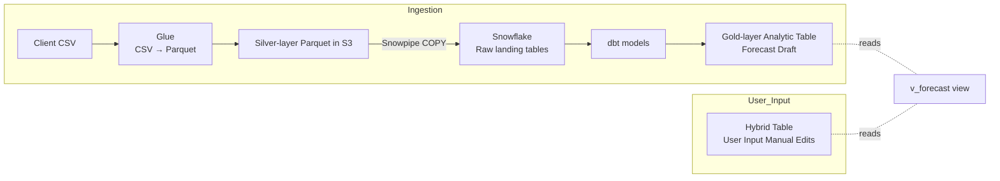

# End-to-End Design Summary

## 1. OLTP vs OLAP Analogy  
* **Postgres (OLTP)** = a busy coffee-shop register → optimized for thousands of tiny, ACID writes.  
* **Snowflake (OLAP)** = the roastery’s tasting-lab → optimized for scanning mountains of historical beans to see flavor trends.

| Strength                           | OLTP (Postgres) | OLAP (Snowflake) |
|------------------------------------|-----------------|------------------|
| Point latency / small transactions | **✓**           | – |
| Massive joins & aggregates         | –               | **✓** |
| Cost scaling with bursty analytics | –               | **✓** (compute pauses) |

 

## 2. GB-scale SaaS Options Evaluated

| Need                            | Best First Pick                          | Key Pros | Key Cons |
|---------------------------------|------------------------------------------|----------|----------|
| Quickest GB-size analytics      | **MotherDuck** (DuckDB-in-cloud)         | dev-friendly, cheap | single-node write path |
| Serverless, elastic dashboards  | **BigQuery + BI Engine**                 | pay-per-query | cost spikes on ad-hoc |
| Enterprise-grade, pay-per-sec   | **Snowflake XS**                         | RBAC, time-travel | credit math |
| API-first, real-time endpoints  | **Tinybird (ClickHouse)**                | REST pipes, 100 ms | less SQL surface |
| AWS-native, cheap burst compute | **Redshift Serverless**                  | same IAM | tuning keys |

 

## 3. Current Pain Points

1. **Glue UPSERT job** (CSV → Postgres) ≈ 25 min.  
2. **dbt models** on Postgres heap ≈ 25 min.  
3. Growing to **50 GB** per tenant; must support front-end edits that appear instantly.

 

## 4. Lakehouse Layering Pattern

| Layer   | Format & Location           | Purpose                                 |
|---------|----------------------------|-----------------------------------------|
| **Bronze** | Raw client CSV in S3          | Immutable lineage backup. |
| **Silver** | Partitioned Parquet in S3     | Columnar, dedup-ready, cheap. |
| **Gold**   | Native warehouse tables       | Fast joins/aggregates for dbt + UI. |

Glue now only **converts CSV → Parquet**; Snowflake autoload and deduplicate.

 

## 5. **Migration Decision**: *Single-Engine* Snowflake with **Hybrid Tables**

> **Recommended for simplicity + growth runway**

### Architecture

### Why It Works
| Point | Detail |
|-------|--------|
| **Real-time edits** | Hybrid Tables give sub-ms inserts; view shows changes instantly. |
| **One RBAC / one backup** | No Postgres CDC plumbing, no cross-db IAM drift. |
| **Cost** | XS warehouse ≈ \$25–30 / mo compute at 1 h / day; storage \$2 / TB. |
| **Scalability limits** | ~1 K TPS write cap & 2 TB hot rows per DB—well above “settings + overrides.” |
| **Analytics stays fast** | Column-store keeps joins and aggregates sub-second even at 50 GB and beyond. |

### Pros
* Simplest mental model for a small engineering team.  
* Cuts dbt runtime to **< 5 min** at 50 GB.  
* Edits visible in **< 100 ms**; no dual writes.

### Cons / Exit Conditions
* If a table ever needs **>1 K writes/sec** or **< 20 ms latency**, introduce a dedicated OLTP (Postgres/Aurora) and keep streaming into Snowflake.  
* Hybrid-table quota is per-database; shard tenants or add OLTP once hot rows > 2 TB.

 

## 6. Handling “Settings” Tables

* **Derived from client files** → land in Silver Parquet, model into Gold dimension tables (`dim_*`).  
* **Tenant toggles / flags** → live in a Hybrid Table (`user_prefs_ht`); UI writes directly.  
* UI always queries a **single view** that joins dims + Hybrid rows, optionally toggled by a bind variable (`$show_manual`).

 

## 7. Alternative Paths (Quick Matrix)

| Scenario                                   | Adopt…                     | Why / When |
|-------------------------------------------|----------------------------|------------|
| Need REST analytics w/ <100 ms SLA only   | **Tinybird**               | Built-in endpoints; keep Snowflake for BI. |
| Want AWS-native stack, less RBAC depth    | **Redshift Serverless**    | Similar cost, Postgres-like SQL. |
| Zero migration tonight, just speed up reads | **pg_duckdb** inside PG    | Free 50-100× read boost; ingest still slow. |

 

## 8. Action Checklist

1. **Enable Unistore** (Hybrid Tables) in Snowflake.  
2. Rewrite Postgres UDF as **`v_forecast` view** in Snowflake.  
3. Create **`manual_edits_ht`** Hybrid Table with PK `(tenant_id, sku_id, date)`.  
4. Slim Glue job: **CSV → partitioned Parquet** only.  
5. Set up **Snowpipe + dbt** on Snowflake; auto-suspend warehouse.  
6. Update API:  
   * `SELECT` on `v_forecast` (toggle manual via param).  
   * `INSERT/UPDATE` on `manual_edits_ht`.  
7. Monitor Hybrid TPS & size; introduce OLTP only if thresholds exceeded.

 

---

### Bottom Line

> **Snowflake-only (Option A) covers today’s GB-scale, analytics-heavy SaaS workload with the fewest moving parts, lets user edits surface in real time, and defers any extra database until you truly need >1 K TPS or sub-20 ms operational queries.**
